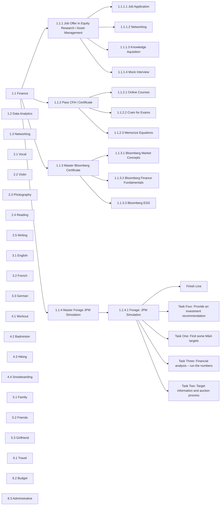

```mermaid
flowchart LR;
  19dbdd3556c280a19b60d9dc7bc349af["1.1 Finance"]
  click 19dbdd3556c280a19b60d9dc7bc349af "https://www.notion.so/1-1-Finance-19dbdd3556c280a19b60d9dc7bc349af"
    19dbdd3556c280a19b60d9dc7bc349af["1.1 Finance"] --> 19ebdd3556c280acac70fa54a6eb0314["1.1.1 Job Offer in Equity Research / Asset Management"]
    click 19ebdd3556c280acac70fa54a6eb0314 "https://www.notion.so/1-1-1-Job-Offer-in-Equity-Research-Asset-Management-19ebdd3556c280acac70fa54a6eb0314"
      19ebdd3556c280acac70fa54a6eb0314["1.1.1 Job Offer in Equity Research / Asset Management"] --> 19ebdd3556c280718ae9ead4c6002187["1.1.1.1 Job Application"]
      click 19ebdd3556c280718ae9ead4c6002187 "https://www.notion.so/1-1-1-1-Job-Application-19ebdd3556c280718ae9ead4c6002187"
      19ebdd3556c280acac70fa54a6eb0314["1.1.1 Job Offer in Equity Research / Asset Management"] --> 19ebdd3556c28048bfc1c4cb643288dd["1.1.1.2 Networking"]
      click 19ebdd3556c28048bfc1c4cb643288dd "https://www.notion.so/1-1-1-2-Networking-19ebdd3556c28048bfc1c4cb643288dd"
      19ebdd3556c280acac70fa54a6eb0314["1.1.1 Job Offer in Equity Research / Asset Management"] --> 19ebdd3556c28002baf7f453d09732e3["1.1.1.3 Knowledge Aquisition"]
      click 19ebdd3556c28002baf7f453d09732e3 "https://www.notion.so/1-1-1-3-Knowledge-Aquisition-19ebdd3556c28002baf7f453d09732e3"
      19ebdd3556c280acac70fa54a6eb0314["1.1.1 Job Offer in Equity Research / Asset Management"] --> 19ebdd3556c280ecbe63d7df9e00dc18["1.1.1.4 Mock Interview"]
      click 19ebdd3556c280ecbe63d7df9e00dc18 "https://www.notion.so/1-1-1-4-Mock-Interview-19ebdd3556c280ecbe63d7df9e00dc18"
    19dbdd3556c280a19b60d9dc7bc349af["1.1 Finance"] --> 19ebdd3556c280aeaf2ddae1af1baced["1.1.2 Pass CFA I Certificate"]
    click 19ebdd3556c280aeaf2ddae1af1baced "https://www.notion.so/1-1-2-Pass-CFA-I-Certificate-19ebdd3556c280aeaf2ddae1af1baced"
      19ebdd3556c280aeaf2ddae1af1baced["1.1.2 Pass CFA I Certificate"] --> 19ebdd3556c28051be61e20d76155dca["1.1.2.1 Online Courses"]
      click 19ebdd3556c28051be61e20d76155dca "https://www.notion.so/1-1-2-1-Online-Courses-19ebdd3556c28051be61e20d76155dca"
      19ebdd3556c280aeaf2ddae1af1baced["1.1.2 Pass CFA I Certificate"] --> 19ebdd3556c2807ea533e18ad7ef1728["1.1.2.2 Cram for Exams"]
      click 19ebdd3556c2807ea533e18ad7ef1728 "https://www.notion.so/1-1-2-2-Cram-for-Exams-19ebdd3556c2807ea533e18ad7ef1728"
      19ebdd3556c280aeaf2ddae1af1baced["1.1.2 Pass CFA I Certificate"] --> 19ebdd3556c280f18db2cf0fc6b8cdf9["1.1.2.3 Memorize Equations"]
      click 19ebdd3556c280f18db2cf0fc6b8cdf9 "https://www.notion.so/1-1-2-3-Memorize-Equations-19ebdd3556c280f18db2cf0fc6b8cdf9"
    19dbdd3556c280a19b60d9dc7bc349af["1.1 Finance"] --> 19ebdd3556c280399f5cfd89952cca76["1.1.3 Master Bloomberg Certificate"]
    click 19ebdd3556c280399f5cfd89952cca76 "https://www.notion.so/1-1-3-Master-Bloomberg-Certificate-19ebdd3556c280399f5cfd89952cca76"
      19ebdd3556c280399f5cfd89952cca76["1.1.3 Master Bloomberg Certificate"] --> 19ebdd3556c280f18745f78fe1c956a2["1.1.3.1 Bloomberg Market Concepts"]
      click 19ebdd3556c280f18745f78fe1c956a2 "https://www.notion.so/1-1-3-1-Bloomberg-Market-Concepts-19ebdd3556c280f18745f78fe1c956a2"
      19ebdd3556c280399f5cfd89952cca76["1.1.3 Master Bloomberg Certificate"] --> 19ebdd3556c2806092c6c04658aba475["1.1.3.2 Bloomberg Finance Fundamentals"]
      click 19ebdd3556c2806092c6c04658aba475 "https://www.notion.so/1-1-3-2-Bloomberg-Finance-Fundamentals-19ebdd3556c2806092c6c04658aba475"
      19ebdd3556c280399f5cfd89952cca76["1.1.3 Master Bloomberg Certificate"] --> 19ebdd3556c280aeb12ec63eb161553f["1.1.3.3 Bloomberg ESG"]
      click 19ebdd3556c280aeb12ec63eb161553f "https://www.notion.so/1-1-3-3-Bloomberg-ESG-19ebdd3556c280aeb12ec63eb161553f"
    19dbdd3556c280a19b60d9dc7bc349af["1.1 Finance"] --> 19fbdd3556c280c4ae83e91a3d3d1de0["1.1.4 Master Forage JPM Simulation"]
    click 19fbdd3556c280c4ae83e91a3d3d1de0 "https://www.notion.so/1-1-4-Master-Forage-JPM-Simulation-19fbdd3556c280c4ae83e91a3d3d1de0"
      19fbdd3556c280c4ae83e91a3d3d1de0["1.1.4 Master Forage JPM Simulation"] --> 19fbdd3556c28022a6ffd5845d796d93["1.1.4.1 Forage: JPM Simulation"]
      click 19fbdd3556c28022a6ffd5845d796d93 "https://www.notion.so/1-1-4-1-Forage-JPM-Simulation-19fbdd3556c28022a6ffd5845d796d93"
        19fbdd3556c28022a6ffd5845d796d93["1.1.4.1 Forage: JPM Simulation"] --> 19fbdd3556c280189467f33c48c4356a["Finish Line"]
        click 19fbdd3556c280189467f33c48c4356a "https://www.notion.so/Finish-Line-19fbdd3556c280189467f33c48c4356a"
        19fbdd3556c28022a6ffd5845d796d93["1.1.4.1 Forage: JPM Simulation"] --> 19fbdd3556c280b1a014fbd67895625e["Task Four: Provide an investment recommendation"]
        click 19fbdd3556c280b1a014fbd67895625e "https://www.notion.so/Task-Four-Provide-an-investment-recommendation-19fbdd3556c280b1a014fbd67895625e"
        19fbdd3556c28022a6ffd5845d796d93["1.1.4.1 Forage: JPM Simulation"] --> 19fbdd3556c280adb6c2fdb06e4f167a["Task One: Find some M&A targets"]
        click 19fbdd3556c280adb6c2fdb06e4f167a "https://www.notion.so/Task-One-Find-some-M-A-targets-19fbdd3556c280adb6c2fdb06e4f167a"
        19fbdd3556c28022a6ffd5845d796d93["1.1.4.1 Forage: JPM Simulation"] --> 19fbdd3556c280ae903bddf7d1fc6ab4["Task Three: Financial analysis – run the numbers"]
        click 19fbdd3556c280ae903bddf7d1fc6ab4 "https://www.notion.so/Task-Three-Financial-analysis-run-the-numbers-19fbdd3556c280ae903bddf7d1fc6ab4"
        19fbdd3556c28022a6ffd5845d796d93["1.1.4.1 Forage: JPM Simulation"] --> 19fbdd3556c28008ae0cd6b19496af85["Task Two: Target information and auction process"]
        click 19fbdd3556c28008ae0cd6b19496af85 "https://www.notion.so/Task-Two-Target-information-and-auction-process-19fbdd3556c28008ae0cd6b19496af85"
  19dbdd3556c28033bd9bce28334a1f8a["1.2 Data Analytics"]
  click 19dbdd3556c28033bd9bce28334a1f8a "https://www.notion.so/1-2-Data-Analytics-19dbdd3556c28033bd9bce28334a1f8a"
  185bdd3556c2816989cac3b5f721bad0["1.3 Networking"]
  click 185bdd3556c2816989cac3b5f721bad0 "https://www.notion.so/1-3-Networking-185bdd3556c2816989cac3b5f721bad0"
  19dbdd3556c2805b871ed0433dbd8889["2.1 Vocal"]
  click 19dbdd3556c2805b871ed0433dbd8889 "https://www.notion.so/2-1-Vocal-19dbdd3556c2805b871ed0433dbd8889"
  19dbdd3556c28062a034eea03029c8e4["2.2 Violin"]
  click 19dbdd3556c28062a034eea03029c8e4 "https://www.notion.so/2-2-Violin-19dbdd3556c28062a034eea03029c8e4"
  19dbdd3556c280a280f2f90f94bdeea5["2.3 Photography"]
  click 19dbdd3556c280a280f2f90f94bdeea5 "https://www.notion.so/2-3-Photography-19dbdd3556c280a280f2f90f94bdeea5"
  19dbdd3556c280258912e5f642bd9422["2.4 Reading"]
  click 19dbdd3556c280258912e5f642bd9422 "https://www.notion.so/2-4-Reading-19dbdd3556c280258912e5f642bd9422"
  19dbdd3556c28083b743d2b47effaf44["2.5 Writing"]
  click 19dbdd3556c28083b743d2b47effaf44 "https://www.notion.so/2-5-Writing-19dbdd3556c28083b743d2b47effaf44"
  19dbdd3556c2806ea858e8cbb529d5a9["3.1 English"]
  click 19dbdd3556c2806ea858e8cbb529d5a9 "https://www.notion.so/3-1-English-19dbdd3556c2806ea858e8cbb529d5a9"
  19dbdd3556c2809884bee4b2c3e56e42["3.2 French"]
  click 19dbdd3556c2809884bee4b2c3e56e42 "https://www.notion.so/3-2-French-19dbdd3556c2809884bee4b2c3e56e42"
  19ebdd3556c280f29fdeea5bddbec003["3.3 German"]
  click 19ebdd3556c280f29fdeea5bddbec003 "https://www.notion.so/3-3-German-19ebdd3556c280f29fdeea5bddbec003"
  19dbdd3556c280118279f941b1529fdd["4.1 Workout"]
  click 19dbdd3556c280118279f941b1529fdd "https://www.notion.so/4-1-Workout-19dbdd3556c280118279f941b1529fdd"
  19dbdd3556c28011bf2afc8f4b673a07["4.2 Badminton"]
  click 19dbdd3556c28011bf2afc8f4b673a07 "https://www.notion.so/4-2-Badminton-19dbdd3556c28011bf2afc8f4b673a07"
  185bdd3556c28150bdc4e108554553ed["4.3 Hiking"]
  click 185bdd3556c28150bdc4e108554553ed "https://www.notion.so/4-3-Hiking-185bdd3556c28150bdc4e108554553ed"
  19dbdd3556c280268727d3b8f7c1575f["4.4 Snowboarding"]
  click 19dbdd3556c280268727d3b8f7c1575f "https://www.notion.so/4-4-Snowboarding-19dbdd3556c280268727d3b8f7c1575f"
  19dbdd3556c28048b411cb13f2792c65["5.1 Family"]
  click 19dbdd3556c28048b411cb13f2792c65 "https://www.notion.so/5-1-Family-19dbdd3556c28048b411cb13f2792c65"
  19dbdd3556c280d49569f320cd464dd5["5.2 Friends"]
  click 19dbdd3556c280d49569f320cd464dd5 "https://www.notion.so/5-2-Friends-19dbdd3556c280d49569f320cd464dd5"
  19dbdd3556c280ce8d1ff8f314d0bad8["5.3 Girlfriend"]
  click 19dbdd3556c280ce8d1ff8f314d0bad8 "https://www.notion.so/5-3-Girlfriend-19dbdd3556c280ce8d1ff8f314d0bad8"
  19dbdd3556c28090ba8befe77e400508["6.1 Travel"]
  click 19dbdd3556c28090ba8befe77e400508 "https://www.notion.so/6-1-Travel-19dbdd3556c28090ba8befe77e400508"
  19dbdd3556c280d59008fdd6dddb158f["6.2 Budget"]
  click 19dbdd3556c280d59008fdd6dddb158f "https://www.notion.so/6-2-Budget-19dbdd3556c280d59008fdd6dddb158f"
  19dbdd3556c28037907af9b9c5dfe738["6.3 Administrative"]
  click 19dbdd3556c28037907af9b9c5dfe738 "https://www.notion.so/6-3-Administrative-19dbdd3556c28037907af9b9c5dfe738"

```